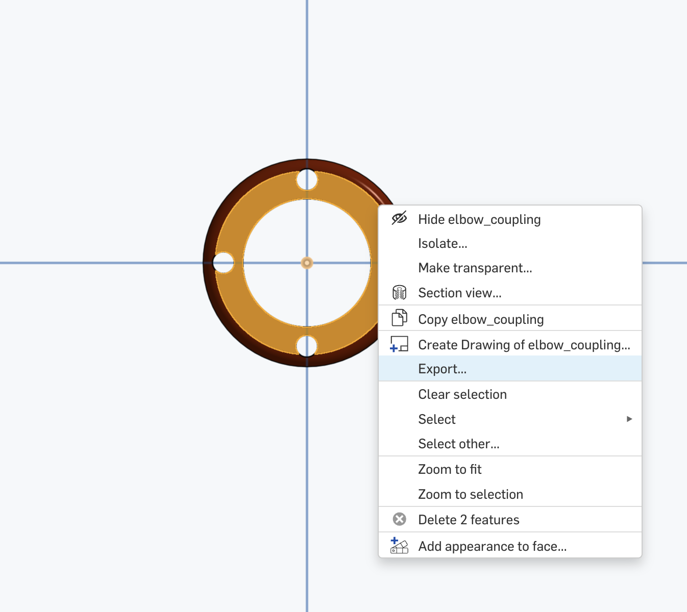
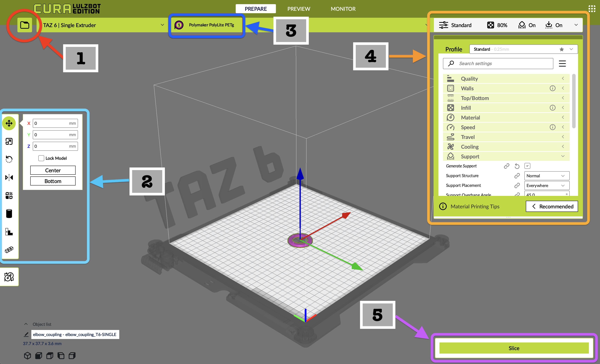
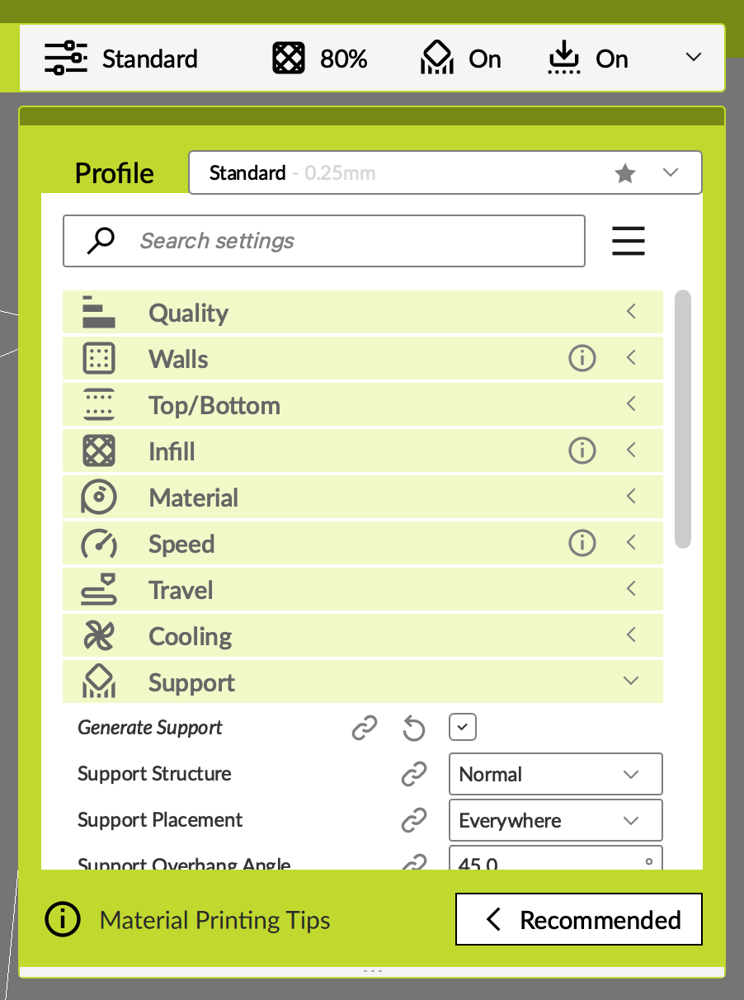
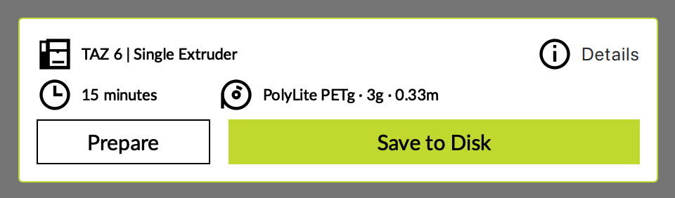
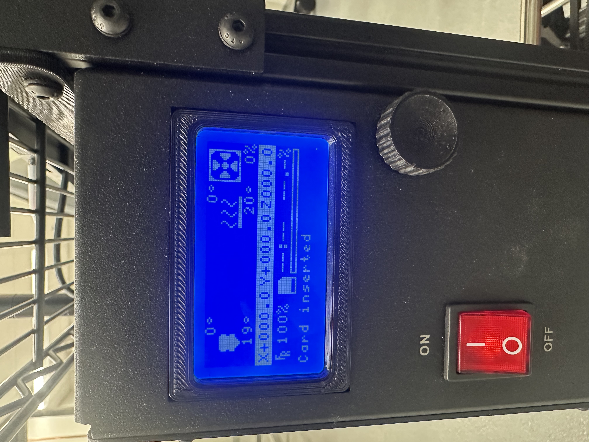
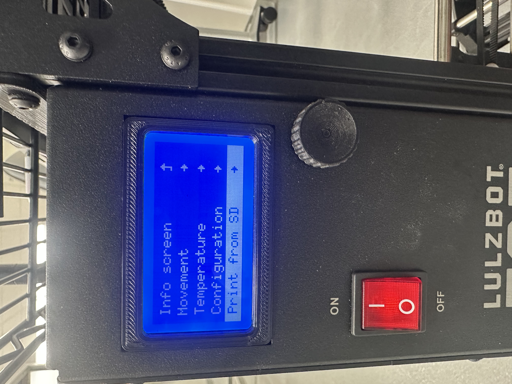
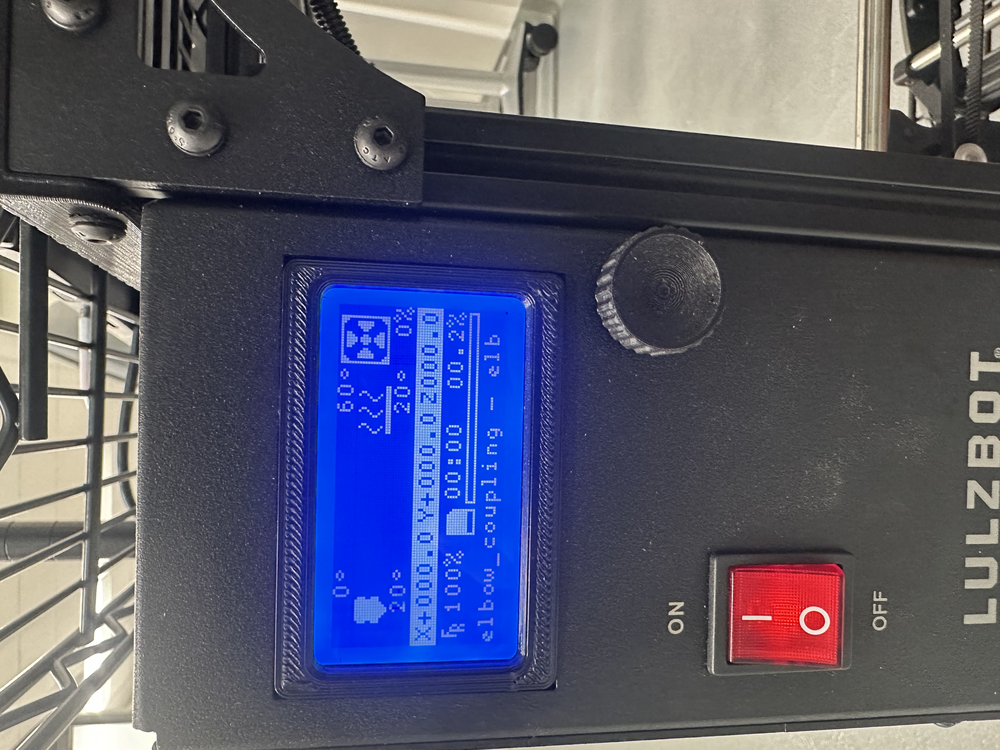

# Operating Documentation for the Lulzbot Taz 6

<br>

## Overview

- [Create a Finished 3D Model](#create-a-finished-3d-model)
- [Create a G-code File](#create-a-g-code-file)
  - [Exporting G-code](#exporting-g-code)
- [Schedule Time With The Printer](#schedule-time-with-the-printer)
- [Configure Printer](#configure-printer)
- [Print Part](#print-part)
- [Clean Up](#clean-up)

<br>

## Create a Finished 3D Model

The first step is to export your 3D model to the STL format. STL (Stereolithography) is a standard file type for 3D printing that most CAD software packages use. It is also the most compatible file type for the slicing software relevant in the next section. If you want to use the machine in the makerspace, be sure to save the STL file to a USB drive.

<p align="center">
  
  <br>
  <em>Make sure to export the part in the STL format.</em>
</p>

<br>
  
## Create a G-code File

Import your part's STL file into the slicing software. For the TAZ6 and the Ultimaker printer, you need to use the Cura slicing software. If you're using the MNRI computer, in a new terminal type the following command:

```bash
./cura_lulzbot.AppImage # For the TAZ6
./cura_ultimaker.AppImage # For the Ultimaker
```

<p align="center">
  
  <br>
  <em>The CURA slicer application page. Here you will find all the necessary tools to create G-code for the TAZ6 printer.</em>
</p>

<br>

> **Interface Overview:**
> 1. Import your part from files
> 2. Part placement settings
> 3. Select filament type
> 4. Print and printer settings
> 5. Start slicing

 <br>

To import your part in Cura, click the folder icon on the left. Once you have imported the part, make sure that the orientation of the part is correct. You can add multiple parts to the print bed as well.

The TAZ6 traditionally uses 2.85 mm filament; however, you can also use the standard 1.75 mm to 1.8 mm filament. In the slicing software, make sure that the Profile is set accordingly (select high detail 1.8 mm if you're using 1.75 mm filament).

<p align="left">
  
  <br>
  <em>The printer settings tab contains the different parameters that can be adjusted for the print job.</em>
</p>

Depending on your part, you may need to add supports. Click the support checkbox, especially if there are overhanging pieces in your part. You can also choose the infill percentage. The infill percentage determines how much filament is used as a percentage of the total volume of the part. 100% infill means that 100% of the volume will be printed. For larger parts, you could use lower infill percentages between 20-40%. For load-bearing parts, use a higher infill between 60-100%.

Lastly, when printing multiple parts, make sure that there is adequate space between parts, particularly if you are using a "brim" on each part. Brims are useful as they help with bed adhesion. If your first layer does not seem to stick well and warps, using a brim may resolve the issue.

### Exporting G-code

Once you have the print settings dialed in, you can export the G-code to an SD card. To print on the 3D printers in the MNRI makerspace, we use SD cards to upload the G-code onto the printer. Simply add your SD card to the host machine (wherever you have your slicer software), select the option to export G-code, and make sure to export it to the SD card. Now you can eject the SD card, which should have the G-code uploaded.

<p align="left">
  
  <br>
  <em>Make sure to export to the SD card volume once the G-code is ready.</em>
</p>

> **Note:** The above steps can be done on any machine. You will need to install the [CURA slicer](https://curaslicer.com/) software.

 <br>

## Schedule Time With The Printer

<!-- This section is intentionally left empty for now -->

## Configure Printer

If you are using the TAZ6, most of the configuration is done in the slicing software. The TAZ6 uses a borosilicate plate as the base on which your part will be printed. For materials like PETG or high infill PLA, you may notice that the part is stuck to the borosilicate plate. Typically, you would use a hammer and a screwdriver to dislodge the part; this may damage the plate. To avoid this, we recommend adding a layer of masking tape to the print bed, completely covering the print surface. This way, when you are done with your print, you can simply peel off the tape along with your part.

## Print Part

To print the part, turn on the printer and insert the SD card into the slot.

<p align="left">
  
</p>

Now you can select the "Print from SD" option. Select your part and start the print.

<p align="left">
  
</p>

The printer will tell you how long the part is going to take to print. We recommend waiting for at least the first layer to print before walking away. This may take a few minutes as the extruder and the print bed need to come up to temperature.

<p align="left">
  
</p>

## Clean Up

Once your print is complete, follow these steps to properly clean up:

1. **Allow Cooling** - Wait for the print bed and extruder to cool down to a safe temperature before attempting to remove your part. This typically takes 5-10 minutes.

2. **Remove the Part** - If you used masking tape on the print bed, simply peel off the tape with the part attached. If printing directly on the borosilicate plate, use a flat scraper or putty knife to carefully separate the part from the bed. Work slowly to avoid damaging the print surface.

3. **Remove Support Material** - If your print included support structures, carefully remove them using pliers or wire cutters. Support material is designed to break away easily but may require some effort for intricate parts.

4. **Clean the Print Bed** - Remove any remaining masking tape, filament residue, or debris from the print bed. Wipe down the borosilicate plate with isopropyl alcohol if needed to ensure it's clean for the next user.

5. **Turn Off the Printer** - If no one else is scheduled to use the printer immediately after you, turn it off using the power switch.

6. **Clean Your Work Area** - Dispose of any scrap material, failed prints, or support structures in the appropriate waste bin. Leave the workspace clean for the next user.

7. **Post-Processing** (Optional) - Depending on your needs, you may want to sand, paint, or otherwise finish your part. This should be done away from the printer in a designated work area.
